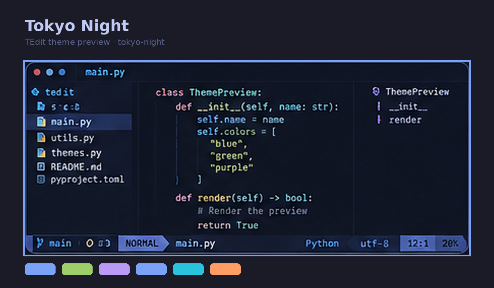
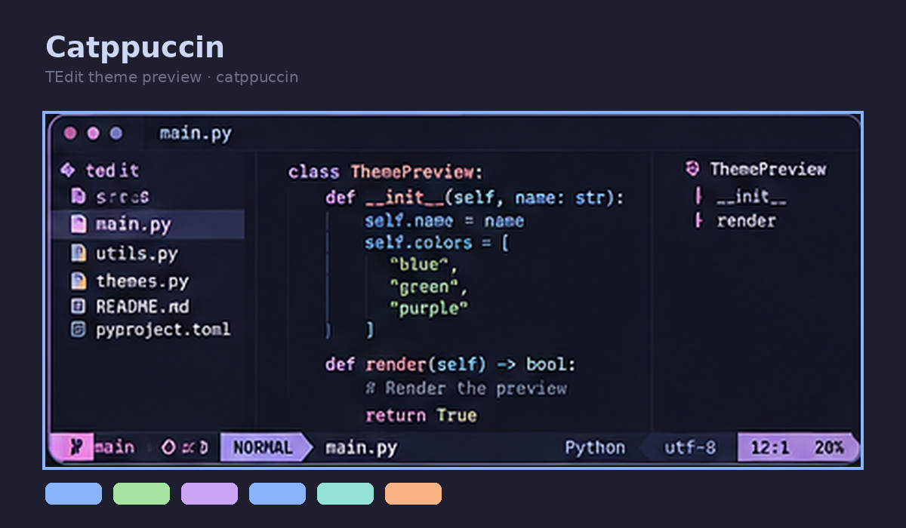
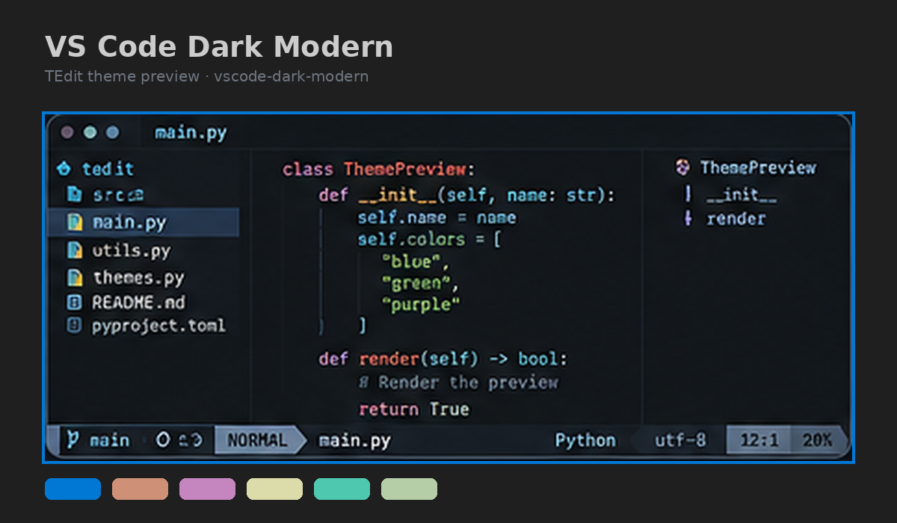
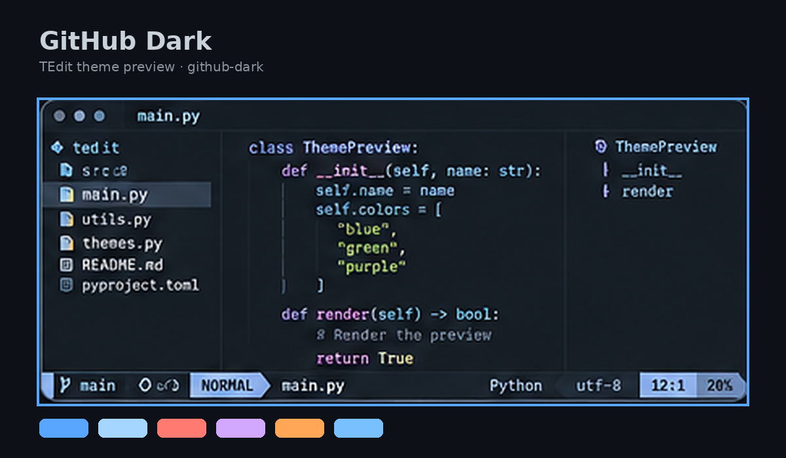
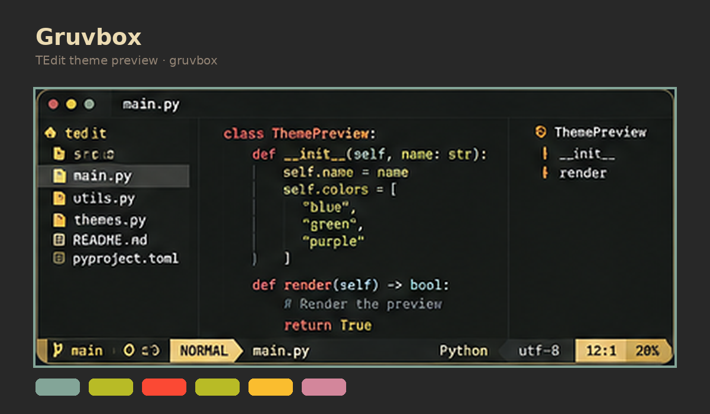
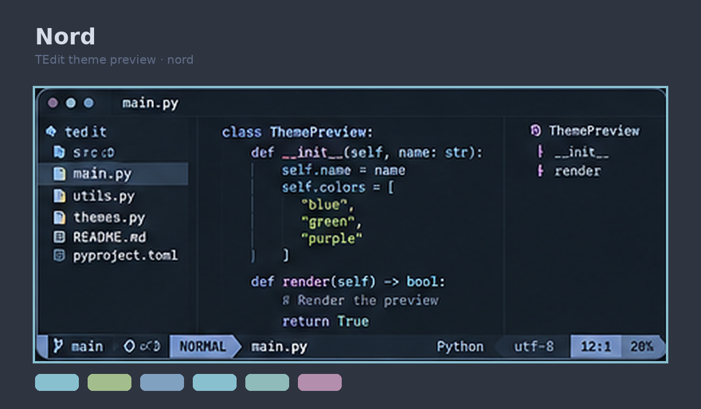
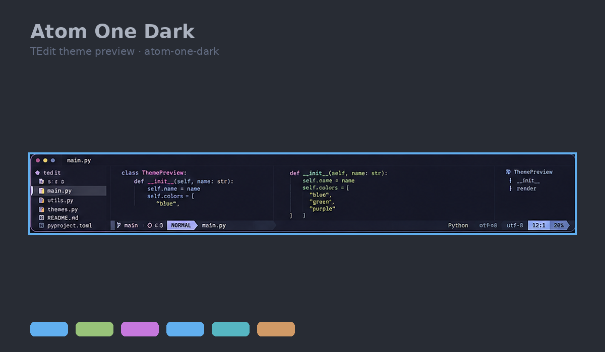

# TEdit v1.1.0

TEdit é um gerenciador de temas e ambientes **isolados** de Neovim para Linux e Termux. Ele permite manter sua configuração normal em `~/.config/nvim`, instalar distribuições como NvChad/LazyVim/AstroNvim em ambientes separados e usar o preset próprio **TEdit Modern**.

O princípio central é simples: experimentar sem transformar `~/.config/nvim` em laboratório.

## Destaques da v1.1

- layout responsivo para Termux, telas estreitas e desktop;
- modos `auto`, `compact`, `desktop` e `native`;
- Neo-tree e Telescope responsivos no TEdit Modern;
- ajuste temporário de sidebars em NvChad, LazyVim e AstroNvim sem editar os presets;

## Destaques da v1.0

- ambientes Neovim isolados via `NVIM_APPNAME`;
- NvChad, LazyVim e AstroNvim como presets externos;
- **TEdit Modern**, preset gerado pelo próprio projeto;
- preview ANSI e preview real descartável de temas;
- autocomplete, LSP, explorer, Telescope, statusline, Git, terminal e Treesitter no TEdit Modern;
- ativação/desativação de features do TEdit Modern;
- gerenciamento básico de linguagens/LSP;
- `tedit nvim update`;
- `tedit doctor` e `tedit debug --report`;
- TUI atualizada;
- testes de isolamento e geração de configuração.

## Instalação

```bash
git clone <url-do-repositorio>
cd tedit
python -m pip install -e .
```

No Termux:

```bash
pkg install python git neovim
python -m pip install -e .
```

Verifique:

```bash
tedit version
tedit doctor
```

## Quick start: TEdit Modern

```bash
tedit nvim install tedit-modern
tedit nvim use tedit-modern
tedit nvim run
```

Na primeira abertura, `lazy.nvim` baixa os plugins do ambiente TEdit Modern.

O ambiente fica em:

```text
~/.config/tedit-nvim-tedit-modern/
```

e é iniciado pelo TEdit com:

```text
NVIM_APPNAME=tedit-nvim-tedit-modern
```

Sua configuração normal continua separada em `~/.config/nvim`.

## Presets disponíveis

```bash
tedit nvim list
```

Presets:

```text
nvchad
lazyvim
astronvim
tedit-modern
```

Instalação:

```bash
tedit nvim install nvchad
tedit nvim install lazyvim
tedit nvim install astronvim
tedit nvim install tedit-modern
```

Escolha o ambiente padrão do TEdit:

```bash
tedit nvim use tedit-modern
```

Abra arquivos:

```bash
tedit nvim run -- main.py
tedit nvim run --preset nvchad -- README.md
```

## Gutter compacto no Termux

Em telas estreitas, o TEdit recupera as colunas entre a numeração e o texto sem esconder diagnósticos:

```lua
signcolumn = "number"
foldcolumn = "0"
numberwidth = 2
statuscolumn = ""
```

Assim, sinais de Git/LSP usam a própria coluna dos números e a área de edição começa imediatamente depois da numeração. O comportamento é aplicado automaticamente em `layout auto` quando a tela tem menos de 100 colunas, ou sempre com:

```bash
tedit nvim layout compact
```

## Layout responsivo

A v1.1 trata telas estreitas como Termux em modo retrato sem alterar permanentemente NvChad, LazyVim ou AstroNvim. O padrão é `auto`:

```bash
tedit nvim layout auto
```

No modo `auto`, o TEdit usa layout compacto quando o Neovim detecta menos de 100 colunas e layout desktop em telas maiores. Consulte o modo atual com:

```bash
tedit nvim layout
```

Modos disponíveis:

```text
auto      adapta à largura atual do terminal
compact   prioriza a área de edição em telas estreitas
desktop   mantém painéis mais largos para telas grandes
native    desliga o shim de layout do TEdit
```

Você também pode sobrescrever o modo apenas para uma execução:

```bash
tedit nvim run --preset astronvim --layout compact
tedit nvim run --preset nvchad --layout desktop
tedit nvim run --preset lazyvim --layout native
```

Nos presets externos, o TEdit injeta um pequeno script somente no processo atual do Neovim. Ele reage a `VimResized`, `WinEnter` e `FileType`, reduzindo sidebars conhecidas como Neo-tree e NvimTree quando necessário. **Nenhum `init.lua` do NvChad/LazyVim/AstroNvim é editado por esse recurso.**

No `tedit-modern`, o comportamento responsivo também faz parte da configuração gerada: o Neo-tree usa cerca de 30% da tela no modo compacto (limitado a 18–24 colunas) e o Telescope prefere layout vertical em telas estreitas.

## TEdit Modern

O **TEdit Modern** é a distribuição/preset própria do projeto. Diferente de NvChad, LazyVim e AstroNvim, ele não clona uma configuração pronta de terceiros: o próprio TEdit mantém um pequeno estado em `.tedit-modern.json` e gera o `init.lua` do ambiente isolado.

A ideia é manter três camadas separadas:

1. **TEdit** gerencia instalação, isolamento, features, linguagens e regeneração da configuração;
2. **lazy.nvim** instala e atualiza os plugins dentro do ambiente `tedit-modern`;
3. **Neovim** continua sendo o editor e executa LSP, Treesitter, autocomplete, Telescope e os demais componentes.

Isso significa que `tedit-modern` não altera `~/.config/nvim`. Ele roda com `NVIM_APPNAME=tedit-nvim-tedit-modern`, mantendo config, dados, cache e estado separados da sua instalação normal.

O arquivo `init.lua` é **gerado**. Se você alterar features ou linguagens com a CLI, execute `tedit nvim modern sync` para garantir que a configuração reflita o estado atual. Para customizações manuais grandes, prefira um preset externo ou espere uma futura camada de `custom.lua`, porque alterações diretas no arquivo gerado podem ser sobrescritas.

Features padrão:

```text
completion   blink.cmp
explorer     neo-tree
telescope    telescope.nvim
statusline   lualine
git          gitsigns
terminal     toggleterm
treesitter   nvim-treesitter
```

Liste o estado:

```bash
tedit nvim modern status
tedit nvim modern feature list
```

Desative ou ative componentes:

```bash
tedit nvim modern feature disable terminal
tedit nvim modern feature enable terminal
```

Toda alteração regenera apenas o `init.lua` do ambiente `tedit-modern`.

### Linguagens e LSP

```bash
tedit nvim modern lang list
```

Linguagens conhecidas:

```text
python
javascript
typescript
lua
rust
go
bash
json
html
css
```

Exemplos:

```bash
tedit nvim modern lang enable rust
tedit nvim modern lang enable go
tedit nvim modern lang disable css
```

O TEdit configura os nomes dos servidores LSP, mas **não instala executáveis de language servers no sistema**. Use `tedit nvim modern lang list` e `tedit doctor` para conferir a configuração; a instalação de `pyright`, `gopls`, `rust-analyzer` etc. continua sob controle do usuário/sistema.

Depois de editar manualmente o estado ou atualizar o TEdit:

```bash
tedit nvim modern sync
```

## Preview de temas

Preview rápido, sem escrever configurações:

```bash
tedit theme preview tokyo-night
tedit theme browse
```

Preview real em Neovim temporário:

```bash
tedit nvim theme preview tokyo-night
```

O preview real usa diretórios XDG temporários e `NVIM_APPNAME=tedit-preview`. Ao fechar o Neovim, o ambiente é descartado.

Temas incluídos:

```text
atom-one-dark
catppuccin
github-dark
gruvbox
nord
tokyo-night
vscode-dark-modern
```

### Galeria e referências dos temas

As imagens abaixo são **previews ilustrativos** para comparação rápida. Para ver a renderização real no seu terminal/Neovim, use `tedit theme preview <tema>` ou `tedit nvim theme preview <tema>`. Os nomes dos temas apontam para os projetos/origens usados como referência visual.

<table>
<tr>
<td width="50%"><a href="https://github.com/folke/tokyonight.nvim"><strong>Tokyo Night</strong></a><br></td>
<td width="50%"><a href="https://github.com/catppuccin/nvim"><strong>Catppuccin</strong></a><br></td>
</tr>
<tr>
<td width="50%"><a href="https://github.com/microsoft/vscode/blob/main/extensions/theme-defaults/themes/dark_modern.json"><strong>VS Code Dark Modern</strong></a><br></td>
<td width="50%"><a href="https://github.com/projekt0n/github-nvim-theme"><strong>GitHub Dark</strong></a><br></td>
</tr>
<tr>
<td width="50%"><a href="https://github.com/morhetz/gruvbox"><strong>Gruvbox</strong></a><br></td>
<td width="50%"><a href="https://github.com/shaunsingh/nord.nvim"><strong>Nord</strong></a><br></td>
</tr>
<tr>
<td colspan="2"><a href="https://github.com/atom/one-dark-syntax"><strong>Atom One Dark</strong></a><br></td>
</tr>
</table>

Aplicação explícita:

```bash
tedit theme set tokyo-night
tedit --dry-run theme set tokyo-night
```

## Atualização dos presets

```bash
tedit nvim update
```

Para presets instalados com `.git`, o TEdit usa `git pull --ff-only`.

Por segurança, NvChad/LazyVim/AstroNvim instalados sem `.git` **não são substituídos automaticamente**. Para aceitar substituição integral:

```bash
tedit nvim update nvchad --replace
```

Faça dry-run primeiro:

```bash
tedit --dry-run nvim update nvchad --replace
```

`tedit-modern` é atualizado/regenerado localmente:

```bash
tedit nvim update tedit-modern
```

## Diagnóstico

```bash
tedit doctor
tedit nvim doctor
tedit debug --report
```

`debug --report` imprime versão do TEdit, SO, Python, Neovim, Git, preset ativo, caminhos XDG e instalações conhecidas. Ele não lê seu código-fonte nem imprime conteúdo dos seus arquivos de configuração.

Exemplo:

```text
TEdit: 1.0.2
Python: 3.x
Neovim: NVIM v0.x
Git: git version x.x
Current preset: tedit-modern
NVIM_APPNAME: tedit-nvim-tedit-modern
```

## TUI

Execute sem subcomandos:

```bash
tedit
```

A interface permite consultar editores, navegar previews, aplicar temas, ver/ativar presets instalados e gerenciar backups básicos.

A CLI continua sendo a interface mais completa e previsível para automação.

## Backup e reset

```bash
tedit backup
tedit backups
tedit restore <id>
tedit reset
```

`reset` cria um backup antes de alterar configurações gerenciadas.

Para remover um preset isolado:

```bash
tedit nvim remove astronvim
```

A remoção recusa caminhos fora do namespace `tedit-nvim-*`.

## Comandos principais

```text
tedit
tedit version
tedit status
tedit doctor
tedit debug --report

tedit theme list
tedit theme current
tedit theme preview <tema>
tedit theme browse
tedit theme set <tema>

tedit nvim list
tedit nvim install <preset>
tedit nvim use <preset>
tedit nvim current
tedit nvim run [--preset <preset>] -- [arquivo...]
tedit nvim path <preset>
tedit nvim env [preset]
tedit nvim doctor
tedit nvim update [preset] [--replace]
tedit nvim theme preview <tema>
tedit nvim remove <preset>

tedit nvim modern status
tedit nvim modern sync
tedit nvim modern feature list
tedit nvim modern feature enable <feature>
tedit nvim modern feature disable <feature>
tedit nvim modern lang list
tedit nvim modern lang enable <linguagem>
tedit nvim modern lang disable <linguagem>

tedit backup
tedit backups
tedit restore <id>
tedit reset
```

## Arquitetura

```text
tedit/
├── tedit/
│   ├── cli.py
│   ├── nvim_manager.py
│   ├── modern.py
│   ├── diagnostics.py
│   ├── theme.py
│   ├── theme_preview.py
│   ├── editors.py
│   ├── detector.py
│   ├── backup.py
│   ├── profile.py
│   ├── tui.py
│   ├── profiles/
│   └── themes/
├── tests/
├── CHANGELOG.md
├── pyproject.toml
└── README.md
```

## Segurança e isolamento

O TEdit separa quatro operações:

```text
preview  -> descartável / sem apply
install  -> cria apenas tedit-nvim-*
use      -> muda o preset ativo do TEdit
remove   -> aceita apenas namespace tedit-nvim-*
```

O TEdit não precisa substituir `~/.config/nvim` para executar seus presets.

## Testes

```bash
python -m unittest discover -s tests -v
python -m compileall -q tedit tests
```

A v1.0 possui testes para:

- renderização de todos os previews sem alterar estado;
- confinamento do preview real em diretório temporário;
- geração do TEdit Modern;
- ativação/desativação de features e linguagens;
- uso da API moderna de LSP;
- dry-run do preset gerado;
- proteção do namespace na remoção.

## Requisitos do TEdit Modern

A configuração usa a API moderna `vim.lsp.enable`, portanto o alvo recomendado é **Neovim 0.11.3+**. Plugins podem elevar seus próprios requisitos no futuro; `tedit doctor` e o gerenciador de plugins do Neovim ajudam a diagnosticar incompatibilidades.

O autocomplete está fixado em `blink.cmp` `1.*`, porque a linha 2.x está em desenvolvimento ativo no momento desta versão.

## Referências técnicas

- Neovim / nvim-lspconfig: https://github.com/neovim/nvim-lspconfig
- lazy.nvim: https://github.com/folke/lazy.nvim
- blink.cmp: https://github.com/Saghen/blink.cmp
- nvim-treesitter: https://github.com/nvim-treesitter/nvim-treesitter
- NvChad starter: https://github.com/NvChad/starter
- LazyVim starter: https://github.com/LazyVim/starter
- AstroNvim template: https://github.com/AstroNvim/template

## Próximos passos depois da v1.0

A v1.0 fecha a primeira arquitetura estável. Evoluções naturais:

- instalação opcional de language servers por provider (`npm`, `pipx`, package manager);
- sistema de plugins extras sem editar Lua manualmente;
- TUI mais interativa e previews capturados diretamente de sessões reais;
- import/export de perfis TEdit Modern;
- testes end-to-end executando uma instalação real do Neovim em CI;
- releases empacotados e atualização do próprio TEdit.
